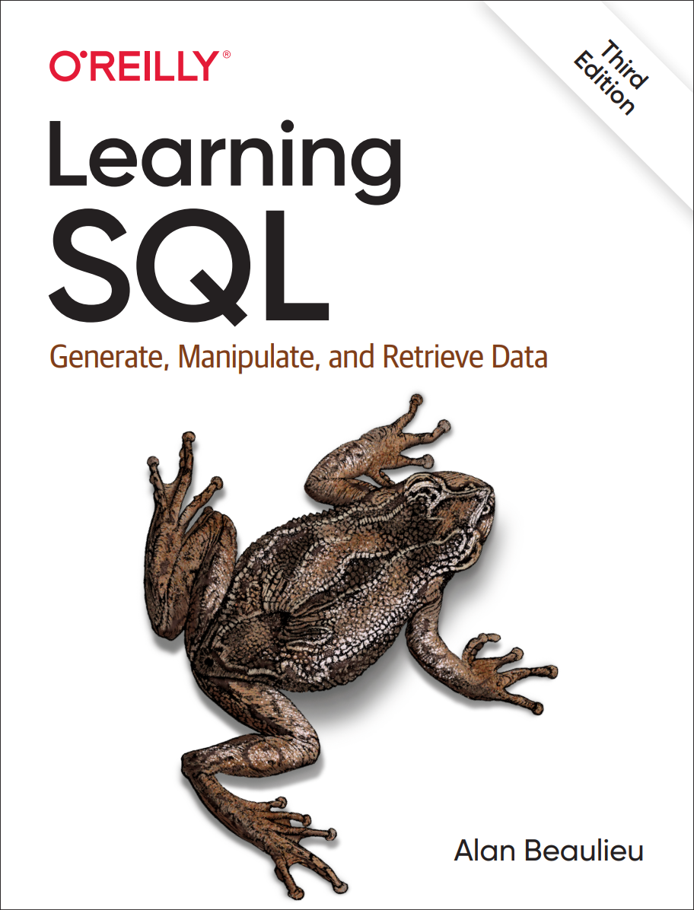

# @luotao/learning-sql.learning-sql

---

## Chapter 2. Creating and Populating a Database

### MySQL Data Types

#### Character Data

- 从 mysql 8 开始, 默认的字符集是 `utf8mb4`
- `varchar` 类型的最大长度为 65535 (64 KB)